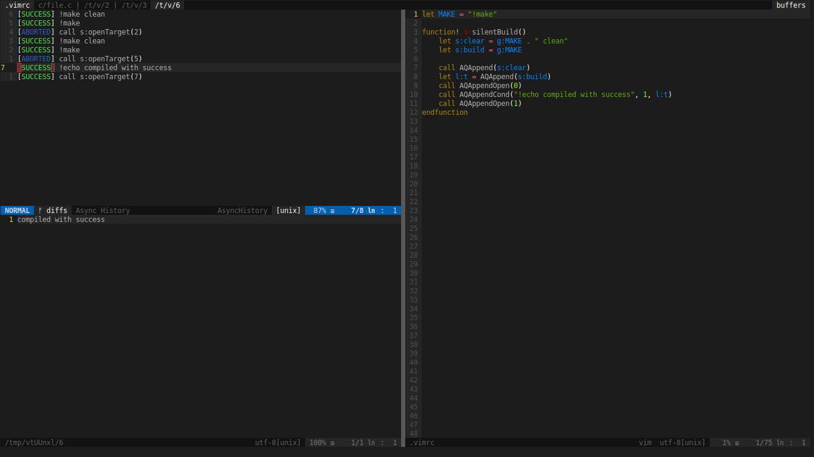

# Async Queue

Collection of utilities used to simplify Vim external operations.
This is written in pure vimscript, so it should work on windows as well, but no tests were conducted.
Requires Vim 8 compiled with jobs.



## Example

It often happens that you end up having a sequence of operations that must be performed one after the other only if each of the previous has succeded, and if any of those fails a buffer with the error must be open.

As an example you may need to compile a file in the current directory, and then, if it the compilation was compleated, run the output. If the compilation failed you wish to see the produced error, otherwise you only want to see the output of the second execution.

A solution would be to write an external script and then manually open the output, but this is annoying. Another one is to write a script in pure vimscript but this prevents Vim to operate until make has compleated his task, and it could take a while.
With Async Queue you can solve the problem in just a few lines. Define a function as follow

```vim
function! CompileAndRun()
	"run make in the background
	let l:index = AQAppend("!g++ main.cpp -o output")

	"open error file if the previous command has failed, abort otherwise
	call AQAppendOpenError(0, l:index)

	"run tests if the first command has succeded, abort otherwise
	let l:index = AQAppendCond("!./build/bin/test", 1, l:index)

	"open output if previous operation was not aborted
	call AQAppendOpen(1, l:index)
endfunction
```
Here is a video of the example.
[](https://asciinema.org/a/223014)

Now you just use "call MakeAndTest()", or you can assign a command, or a short cut to that function to launch the operations in the background.

## Usefull Commands
All commands description can be visited by invoking `:help AQCommands`

```vim
AQHistory 
```
Shows you the history of background tasks.

```vim
AQKill 
```
Kills the current pending background task.

```vim
AQClean 
```
Clears the history

```vim
AQOpen 
```
Opens the stdout of the compleated background task under the cursor

```vim
AQOpenError
```
Open the stderr of the compleated background task under the cursor

```vim
AQRunAgain
```
Run the command under the cursor again, you must be in the history page

```vim
AQRunInTerm
```
Run the command under the cursor again, you must be in the history page.
The output is sent to a new window. Vim must be compiled with the terminal flag.


## Usefull Functions
All commands description can be visited by invoking `:help AQFunctions`

```vim
AQAppend(<command>)
```
Executes the provided command, if it starts with "!" then it will be executed as a terminal command. Otherwise it will be executed internally after all the other ones have been compleated.

```vim
AQAppendOpen([<cond>], [<target>])
```
If target was not provided then the command before this will be used as target. If no cond was provided then this will open the stdout file if target was not aborted. If cond was 1 then the file will be open only if target was succesfull. If cond was 0 then the file will be open only if the target was not succesfull and not aborted.

```vim
AQAppendOpenError([<cond>], [<target>])
```
if target was not provided then the command before this will be used as target. If no cond was provided then this will open the stderr file if target was not aborted. If cond was 1 then the file will be open only if target was succesfull. If cond was 0 then the file will be open only if the target was not succesfull and not aborted.

```vim
AQAppendCond(<command>, [<cond>], [<target>])
```
if target was not provided then the command before this will be used as target. If no cond was provided then this will executed commadn if target was not aborted. If cond was 1 then the command will be executed only if target was succesfull. If cond was 0 then the command will be executed only if the target was not succesfull and not aborted.

```vim
AQAppendAbort(<command>,<target>)
```
Executes the command if target was aborted. 


## Installation

### [Vim-Plug](https://github.com/junegunn/vim-plug)

1. Add `Plug 'drblallo/AsyncQueue` to your vimrc file.
2. Reload your vimrc or restart
3. Run `:PlugInstall`

### [Vundle](https://github.com/VundleVim/Vundle.vim) or similar

1. Add `Plugin 'drblallo/AsyncQueue'` to your vimrc file.
2. Reload your vimrc or restart
3. Run `:BundleInstall`

### [NeoBundle](https://github.com/Shougo/neobundle.vim)

1. Add `NeoBundle 'drblallo/AsyncQueue'` to your vimrc file.
2. Reload your vimrc or restart
3. Run `:NeoUpdate`

### [Pathogen](https://github.com/tpope/vim-pathogen)

```sh
cd ~/.vim/bundle
git clone https://github.com/drblallo/AsyncQueue.git
```
